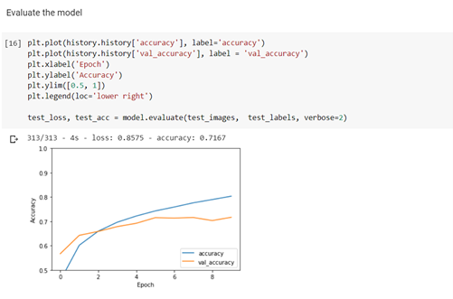
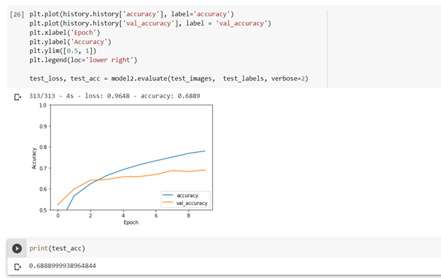

# Deep_Learning

An Academic Assignment on Deep Learning.

## Code and Resources Used

Python Version: 3.8
Packages: tensorflow, matplotlib

CIFAR-10 dataset:https://www.cs.toronto.edu/~kriz/cifar.html
Colab:https://colab.research.google.com/github/tensorflow/docs/blob/master/site/en/tutorials/images/cnn.ipynb

## Model Building 
I developed two convolutional neural networks  models:
* The first convolutional neural networks model with eight layers
* The second convolutional neural networks model with nine layers

## Model Performance
* The accuracy result for model one is 71.67%.

* The accuracy result for model two is 68.89%. 

## Overall 

In conclusion, the best convolutional neural networks model between the two is model one based on the 71.67% accuracy. 
